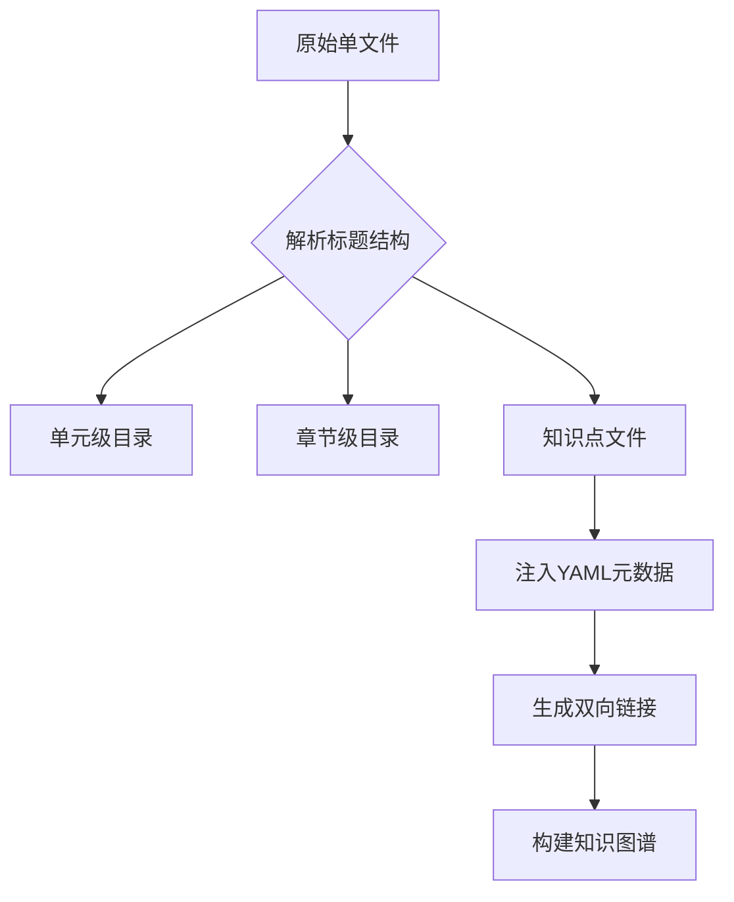

根据你的具体场景和AI训练需求，建议采用 **"原子化知识单元+分层聚合"** 的架构模式。以下是基于微积分案例的详细改造方案：

---

### 一、现有结构诊断与改造策略
```markdown
# 原始结构示例
└─ 微积分.md (10万+行)
   ├─ # 单元一：函数与极限
   │  ├─ ## 1.1 映射与函数
   │  │  ├─ ### 知识点：复合函数
   │  │  │  ├─ 定义
   │  │  │  ├─ 示例：f(g(x)) = sin(x²)
   │  │  │  └─ 注意事项
   │  │  └─ ### 知识点：反函数
   │  └─ ## 1.2 数列极限
   └─ # 单元二：导数与微分
```

#### 改造原则：
1. **原子化拆分**：每个**知识点**作为独立文件（粒度到###级标题）
2. **层级聚合**：通过YAML元数据保持原章节关系
3. **交叉引用**：用双链语法替代原有关联

---

### 二、文件拆分标准操作流程

#### 步骤1：建立目录索引框架
```bash
calculus/
├─ _toc.yml                # 全局目录树
├─ UNIT01_函数与极限/
│  ├─ CHAPTER01_映射与函数/
│  │  ├─ 1.1.1_复合函数.md
│  │  └─ 1.1.2_反函数.md
│  └─ CHAPTER02_数列极限/
└─ UNIT02_导数与微分/
```

#### 步骤2：定义元数据关联规则
```markdown
# 每个知识点文件头部
---
semantic_id: "CAL-UNIT01-CH01-K01"  # 编码规则：学科-单元-章-知识点
position:
  unit: 1
  chapter: 1
  sequence: 1
parent_nodes: ["CAL-UNIT01-CH01"]    # 直接上级节点
child_nodes: ["CAL-UNIT01-CH01-K01-EX1"] # 下级示例节点
---
```

#### 步骤3：内容拆分示例
原始内容：
```markdown
### 知识点：复合函数
**定义**：设函数y=f(u)...  
**示例**：f(g(x))=sin(x²)  
**注意**：定义域需满足...
```

改造后：
```markdown
# calculus/UNIT01/CHAPTER01/1.1.1_复合函数.md
---
concept: "复合函数"
semantic_id: "CAL-UNIT01-CH01-K01"
parent_nodes: ["CAL-UNIT01-CH01"]
related:
  - "反函数::CAL-UNIT01-CH01-K02"
  - "函数定义域::CAL-PRE-C01"
---
## 核心定义
设函数$y=f(u)$...

## 典型示例
```python
def composite(f, g):
    return lambda x: f(g(x))

f = lambda u: np.sin(u)
g = lambda x: x**2
fg = composite(f,g)  # fg(x)=sin(x²)
```

## 注意要点
!> 定义域需满足$g(x) \in D(f)$...
```

---

### 三、特殊内容处理方案

#### 1. 连续推导过程处理
```markdown
# calculus/UNIT03/CHAPTER05/3.5.2_洛必达法则证明.md
---
derivation_type: "定理证明"
prerequisites: ["柯西中值定理::CAL-UNIT03-CH04-K03"]
steps:
  - 建立辅助函数
  - 应用柯西中值定理
  - 处理导数比值形式
---
## 证明过程

### 步骤1：构造辅助函数
令$F(x)=f(x)-f(a)$...

### 步骤2：应用柯西定理
存在$\xi \in (a,x)$使得：
$$\frac{F(x)}{G(x)} = \frac{F'(\xi)}{G'(\xi)}$$

[//]: # (使用折叠块收纳详细推导)
<details>
<summary>详细代数推导</summary>
...
</details>
```

#### 2. 跨章节关联处理
```markdown
# 在泰勒公式文件中
---
related:
  - "多项式逼近::CAL-UNIT02-CH03-K05"
  - "误差估计::CAL-UNIT04-CH02-K01"
---

当研究函数局部逼近时，可结合[[多项式逼近]]方法，其误差分析需用到[[误差估计::CAL-UNIT04-CH02-K01]]中的技巧。
```

---

### 四、自动化迁移工具链

#### 1. 使用Pandoc进行智能拆分
```bash
# 将大文件拆分为层级结构
pandoc -s --wrap=none 微积分.md -o tmp.json

# 解析JSON生成文件树
python splitter.py \
  --input tmp.json \
  --hierarchy "#,##,###" \
  --output-dir calculus
```

#### 2. 元数据自动注入脚本
```python
# 自动生成semantic_id和position
import yaml

def generate_metadata(headers):
    unit = headers[0].split('：')[1]
    chapter = headers[1].split(' ')[1]
    seq = f"{unit}-{chapter}-{uuid}"
    return yaml.dump({
        'semantic_id': f"CAL-{seq}",
        'position': {
            'unit': int(unit),
            'chapter': int(chapter.split('.')[0])
        }
    })
```

---

### 五、新旧体系对比分析

| 维度         | 旧单文件体系                          | 新原子化体系                          |
|--------------|-----------------------------------|-----------------------------------|
| AI检索效率    | 需要全文扫描                        | 通过semantic_id直接定位            |
| 知识更新       | 修改牵一发而动全身                   | 独立文件局部更新                    |
| 关系可视化     | 线性结构难展示网络关系                | 可生成3D知识图谱                   |
| 训练数据准备   | 需复杂预处理                        | 天然适合fine-tuning                |
| 多人协作       | 合并冲突率高                        | 基于目录树的并行编辑                |

---

### 六、实施路线图建议

1. **试点阶段**（1周）
   - 选择"极限"章节进行拆分试验
   - 验证元数据系统的有效性
   - 调整文件粒度阈值（建议300-500行/文件）

2. **批量迁移**（2-3周）
   - 用脚本处理80%常规内容
   - 手工处理特殊数学推导
   - 建立全局索引文件

3. **质量增强**（持续）
   - 添加跨学科链接（如物理中的导数应用）
   - 注入错题集数据作为负面样本
   - 定期运行知识一致性检查



这种改造方案不仅保持原知识体系的完整性，还能通过语义网络增强AI的推理能力。建议配合使用 [Quiver](https://happenapps.com/) 或 [Trilium Notes](https://github.com/zadam/trilium) 等支持科学公式的工具进行知识管理。